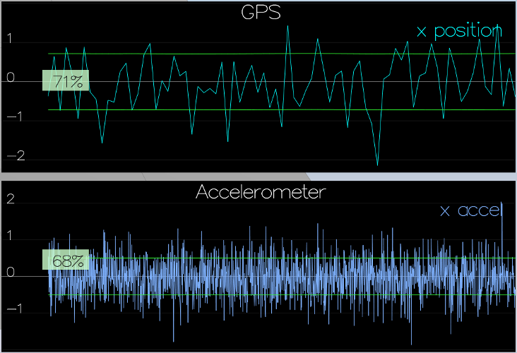
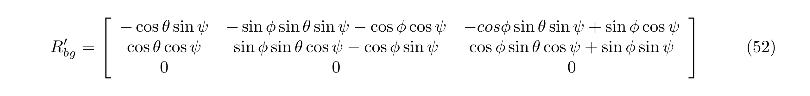
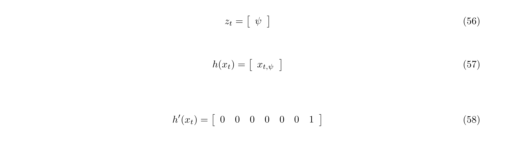

# Estimation Project #

This is the implementation of FCND Estimation project.

### Step 1: Sensor Noise ###

1. Capture `config/log/Graph1.txt` (GPS X data) and `config/log/Graph2.txt` (Accelerometer X data)
2. Calculate standard deviation using Google Sheets:


3. Put results to `config/6_Sensornoise.txt`

4. Run simulator and check the result:



### Step 2: Attitude Estimation ###

1. In `QuadEstimatorEKF.cpp`, update function `UpdateFromIMU()` as described in **7.1.2 Nonlinear Complementary Filter**:


- create a quaternion `qt` from Euler angles using `FromEuler123_RPY` function:
```
 Quaternion<float> qt = Quaternion<float>::FromEuler123_RPY(rollEst, pitchEst, ekfState(6))
```
- use `IntegrateBodyRate()` function (which is just multiplication of 2 quaternions) to integrate gyro rate
- use `ToEulerRPY()` to convert resulting quaternion back to Euler angles Roll, Pitch and Yaw
```
  V3D predictedRPY = qt.IntegrateBodyRate(gyro, dtIMU).ToEulerRPY();
  float predictedPitch = predictedRPY.y; // Pitch
  float predictedRoll = predictedRPY.x; // Roll
  ekfState(6) = predictedRPY.z; // Yaw
```
- normalize yaw to -pi .. pi
```
  // normalize yaw to -pi .. pi
  if (ekfState(6) > F_PI) ekfState(6) -= 2.f*F_PI;
  if (ekfState(6) < -F_PI) ekfState(6) += 2.f*F_PI;
```
- the rest of the code (already implemented) completes the filter:

 

2. Run simulator ann check:


### Step 3: Prediction Step ###

1. Implement the state prediction step in the `PredictState()` functon as described in **7.2 Transition Model**:

taking into account that control vector `ut` is x,y,z accelerations in body frame + Yaw rate:

Note, we don't really have to calculate the rotation matrix `Rbg`, just rotate the accelerations part of control vector `ut` using `Rotate_BtoI()` function of the attitude quaternion.
```
  // X,Y,Z
  predictedState[0] = predictedState[0] + predictedState[3] * dt;
  predictedState[1] = predictedState[1] + predictedState[4] * dt;
  predictedState[2] = predictedState[2] + predictedState[5] * dt;

  // velocities X, Y, Z
  V3F accelXYZ = attitude.Rotate_BtoI(accel);
  predictedState[3] = predictedState[3] + accelXYZ.x * dt;
  predictedState[4] = predictedState[4] + accelXYZ.y * dt;
  predictedState[5] = predictedState[5] - CONST_GRAVITY * dt + accelXYZ.z * dt;
```
Note, there is no need to update `predictedState[6]` as it was updated at the previous step.

2. Implement function `GetRbgPrime()`, just fill coefficients as following:

3. Implement `Predict()` function:
- fill `gPrime` matrix as following:

```
  gPrime(0,3) = dt;
  gPrime(1,4) = dt;
  gPrime(2,5) = dt;

  VectorXf ut(3);
  ut << accel[0], accel[1], accel[2];
  gPrime.block<3,1>(3,6) = RbgPrime * ut * dt;
```
- update covarinace using matrix multiplication:

```
  ekfCov = gPrime * ekfCov * gPrime.transpose() + Q;
```
4. Tune the process parameters in `QuadEstimatorEKF.txt` 


### Step 4: Magnetometer Update ###

1. Implement magnetometer update function `UpdateFromMag()` as described in **7.3.2 Magnetometer**:

```
  hPrime(0,6) = 1;
  zFromX(0) = ekfState(6);
```
then normalize the difference between measured and estimated yaw
```
  //Normalize
  if (z(0)-ekfState(6) > F_PI) z(0) -= 2.f*F_PI;
  if (z(0)-ekfState(6) < -F_PI) z(0) += 2.f*F_PI;
```
2. Tune `QYawStd` parameter:


### Step 5: Closed Loop + GPS Update ###

1. Implement the EKF GPS Update in the function `UpdateFromGPS()` as described in **7.3.1 GPS**:

```
  hPrime.block<6,6>(0,0).setIdentity();
  zFromX = ekfState.head(6);
```
2. Run with default controller:


### Step 6: Adding Your Controller ###

1. Replace `QuadController.cpp` and `QuadControlParams.txt` with the controller / params from the last project.


2. Relax the gains in `QuadControlParams.txt`, so the path is smooth:


